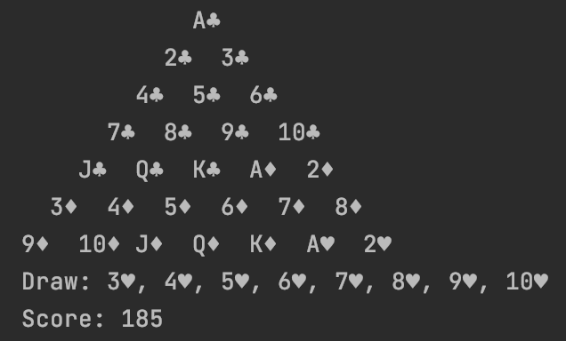
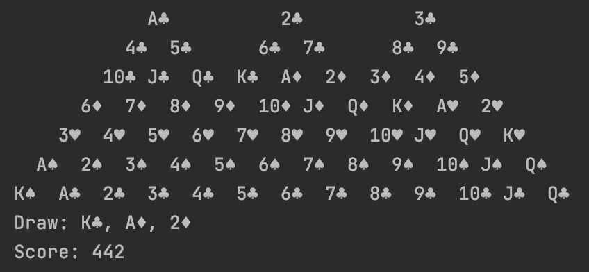
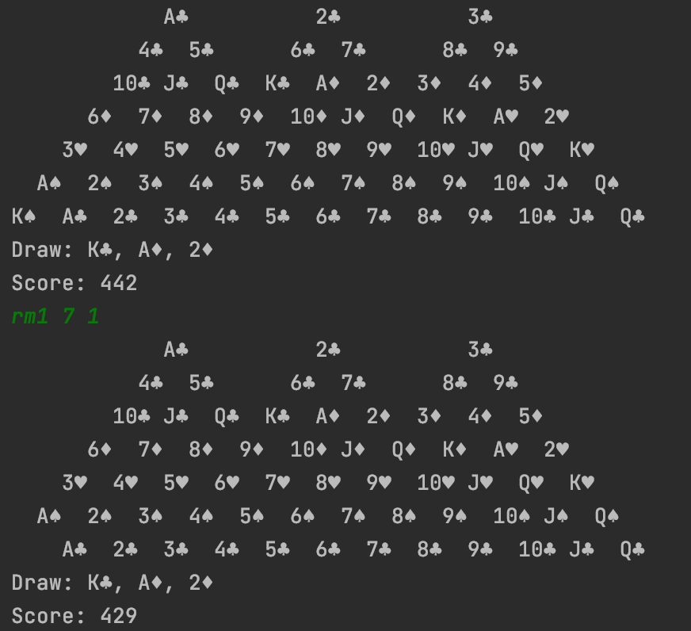

# Pyramid Solitaire Game

Implemented the single-player Pyramid Solitaire game for my Object Oriented Design class in Java. \
We were given starter code to build our project on. The starter interfaces are as listed below: \
-PyramidSolitaireModel interface \
-PyramidSolitaireView interface \
-PyramidSolitaireController interface \
 \
The models maintain the state of the game and update whenever the client makes a move. \
	-Basic Pyramid Solitaire \
	 \
	-Relaxed Pyramid Solitaire (any cards covered by only one other card are allowed to be removed as a pair) \
	-Tripeaks Pyramid Solitaire (uses 104 cards where the shape of the pyramid has three peaks) \
	 \
The view renders any model textually. \
The controller accepts and stores the Readable and Appendable for user input and output where the inputs are received \
by the Readable while the outputs are written to the Appendable. \
 \
## Game Layout
A standard deck of 52 cards are shuffled and dealt out into rows of lines that create a triangular shape where each \
card is partially covered by two cards underneath. The remaining cards are placed face-down in a pile called "stock". \
A number of cards are then turned face-up from the stock. \
A card that is uncovered by other cards underneath are "exposed". Each card has values that equal the number written on \
the card. As for the picture cards, Jacks equal 11, Queens 12, and Kings 13. \
 \
## Game Rules
You can only remove one or two of the exposed cards if their values sum to exactly 13. You are allowed to turn over a \
card from the visible card(s) from the stock (called "draw" cards) and use that to try to remove a card from the pyramid. \
A draw card is automatically replaced with the next card from the stock when used. \
 \
The final score of the game is the sum of all the values of the remaining cards in the pyramid. Your goal as the player \
is to try to obtain the lowest score possible where zero means all the cards in the pyramid have been eliminated. \
 \
 \
## How to play
 \
First, directions for the setup in IntelliJ IDEA: \
1) Run > Edit configurations \
2) Select the "+" button and click on "Application" from the dropdown. \
3) Write the name of the configuration as the type of model and the number of specified rows and number of draw cards \
(ex. "Relaxed 5/4") for convenience. \
4) In the text box for the "Main" class, enter "cs3500.pyramidsolitaire.PyramidSolitaire". \
5) In the text box for "Program arguments", first enter either "basic", "relaxed", or "tripeaks" to determine which \
version of the game you would like to play. Then, you may optionally enter two more arguments R and D where R determines \
the number of rows and D the number of draw cards you would like. If unspecified, the default is 7 rows and 3 draw cards. \
(ex. "relaxed 5,4" produces a game of the solitaire with relaxed rules where the pyramid has 5 rows and 4 visible draw cards) \
6) Everything else should be left at default. Click "OK". \
Steps 1-6 can be repeated as needed to run any number of configurations necessary. Use the drop-down menu next to the \
run icon in the toolbar to choose among them and press "Run". \
 \
 \
After the game has started, use the commands below to proceed with game. Every input should be written in the console: \
 \
 \
-Remove 1 card from the pyramid: input "rm1" followed by the row and card number of the card. (ex. "rm1 7 1" removes \
the 1st card from row 7) \
 \
-Remove 2 cards from the pyramid: input "rm2" followed by the row and card numbers of each card. (ex. "rm2 2 4 7 7" \
removes the fourth card from row 2 and the 7th card from row 7) \
 \
-Remove a card from the pyramid using a draw card: input "rmwd" followed by the position of the draw card and the row \
and card number of the card from the pyramid. (ex. "rmwd 2 4 1" removes the second card from the draw pile and the \
first card from row 4) \
 \
-Remove a draw card: input "dd" followed by the position number of the draw card. (ex. "dd 1" removes the first draw card) \
 \
-Quit game: enter "q" or "Q" anytime \
 \
Note: The inputs begin from 1 for all row and card numbers to account for user friendliness. \
Enjoy!
